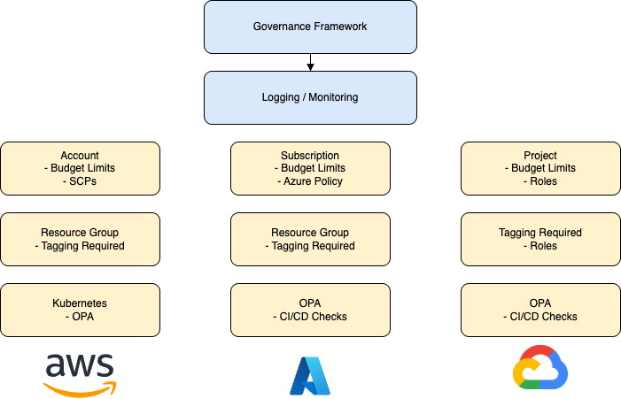
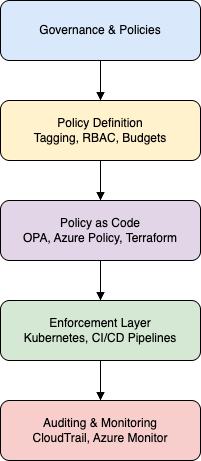

# Governance & Policies

> **Überblick**  
> In der heutigen digitalisierten Welt gewinnen Governance-Strukturen und unternehmensweite Policies zunehmend an Bedeutung. Sie schaffen nicht nur klare Regeln und Verantwortlichkeiten im Umgang mit IT-Systemen, sondern bilden auch das Fundament für sichere, transparente und regelkonforme IT-Infrastrukturen. Besonders im Kontext von Cloud-Computing, IT-Sicherheit und regulatorischen Anforderungen wie der DSGVO sind Governance und Policies unerlässlich.

---

## 1. Was sind „Governance“ und „Policies“?

### 1.1 Governance

„Governance“ beschreibt allgemein die Strukturen, Prozesse und Mechanismen zur Steuerung und Kontrolle einer Organisation. Im IT-Kontext bezieht sich der Begriff auf **IT-Governance** – also die organisatorischen und prozessualen Rahmenbedingungen, die sicherstellen, dass **IT-Strategien im Einklang mit den Unternehmenszielen** stehen.

Wichtige Ziele der IT-Governance:
- **Strategische Ausrichtung**: Die IT soll zur Wertschöpfung des Unternehmens beitragen.
- **Effizienz**: Optimale Ressourcennutzung (z. B. Cloud-Kosten, Humanressourcen).
- **Risikomanagement**: Frühzeitiges Erkennen und Behandeln von IT-Risiken.
- **Compliance**: Einhaltung gesetzlicher und regulatorischer Vorgaben (z. B. DSGVO, ISO/IEC 27001).
- **Performance Measurement**: Messung und Steuerung der IT-Leistung anhand KPIs.

Typische Standards und Frameworks:
- **COBIT (Control Objectives for Information and Related Technology)**
- **ISO/IEC 38500**: Internationale Norm für IT-Governance
- **ITIL**: Framework für das IT-Service-Management

---

### 1.2 Policies

Policies sind **formale, dokumentierte Richtlinien**, die innerhalb des Governance-Rahmens erstellt werden, um gewünschtes Verhalten sicherzustellen. Sie regeln unter anderem:

- Wer darf welche Systeme und Daten nutzen?
- Wie lange und wo werden Daten gespeichert?
- Welche Anforderungen gelten für Passwörter oder Mehrfaktor-Authentifizierung?
- Wie werden Cloud-Ressourcen bereitgestellt, getaggt und überwacht?

Policies gelten als **unternehmensweite Leitlinien**, oft ergänzt durch **Standards, Guidelines und Procedures**, die die konkrete Umsetzung regeln.

Beispiele:
- **Password Policy**: Mindestlänge, Komplexität, Änderungsintervall
- **Acceptable Use Policy (AUP)**: Welche Geräte und Dienste dürfen wie genutzt werden?
- **Cloud Security Policy**: Regeln zur sicheren Nutzung von Public-Cloud-Diensten (z. B. AWS, Azure)
- **Data Retention Policy**: Aufbewahrungs- und Löschfristen für Daten

---

## 2. Relevanz und Anwendungskontext

Governance und Policies sind besonders relevant in folgenden Szenarien:

### 2.1 Cloud Computing

Mit der Migration von On-Premises-Systemen in die Cloud wachsen die Anforderungen an zentrale Steuerung:
- Unterschiedliche Teams provisionieren Ressourcen → zentrale Policies verhindern Wildwuchs
- Cloud-Governance-Tools helfen, Budgetlimits, Tagging-Konventionen oder Sicherheitsregeln durchzusetzen
- Beispiel: **Azure Policy** blockiert automatisch Ressourcenbereitstellungen, die nicht konform sind

#### Visualisierung: Governance in der Multi-Cloud-Umgebung

Die folgende Grafik zeigt, wie Governance-Mechanismen (z. B. Richtlinien, Rollen, Policy-as-Code) in einer Multi-Cloud-Landschaft angewendet werden können:

**Abbildung X**: Umsetzung von Governance Policies in einer Multi-Cloud-Umgebung mit AWS, Azure und GCP

### 2.2 Datenschutz und Compliance

- Unternehmen sind gesetzlich verpflichtet, personenbezogene Daten zu schützen (z. B. Art. 32 DSGVO).
- Policies legen fest, wie Daten verarbeitet, gespeichert und gelöscht werden müssen.
- Audits und Zertifizierungen (z. B. ISO 27001) erfordern dokumentierte und kontrollierte Prozesse

### 2.3 DevOps & CI/CD

- In automatisierten Deployments braucht es Policies als „guardrails“
- Beispiel: **Open Policy Agent (OPA)** kann verhindern, dass Kubernetes-Deployments unsichere Konfigurationen enthalten
- Richtlinien prüfen z. B., ob Container-Images nur aus einem internen Registry kommen

---

## 3. Technische Umsetzung – „Policy as Code“

In modernen IT-Umgebungen erfolgt die Durchsetzung von Richtlinien nicht manuell, sondern **automatisiert und in Codeform**.

### 3.1 Policy as Code (PaC)

- Policies werden als deklarativer Code geschrieben (z. B. Rego für OPA, JSON/YAML für Azure Policy)
- Integration in CI/CD-Pipelines, Kubernetes Admission Controller oder Cloud-Konfigurationen
- Vorteil: Nachvollziehbarkeit, Versionierbarkeit (Git), Automatisierung

### 3.2 Rollenbasierte Zugriffskontrolle (RBAC)

- Zentrale Methode zur Steuerung von Berechtigungen
- Beispiel: In Kubernetes oder AWS wird einem User eine Rolle mit vordefinierten Rechten zugewiesen
- Kombiniert mit Policies (z. B. Least Privilege Policy)

### 3.3 Auditing und Monitoring

- Tools wie **AWS CloudTrail**, **Azure Monitor**, **GCP Audit Logs** erfassen, wer wann welche Aktion durchgeführt hat
- Grundlage für forensische Analysen und Compliance-Nachweise

### 3.4 Beispiel: Cloud Governance Architektur

Die folgende Darstellung zeigt eine typische Umsetzung von Governance & Policies im Cloud-Kontext – von der Definition über die technische Durchsetzung bis zur Überwachung:

---

## 4. Gängige Tools, Frameworks und Produkte

| Kategorie                     | Tools / Produkte                                                |
|------------------------------|-----------------------------------------------------------------|
| Cloud Governance Frameworks  | AWS Organizations, Azure Policy, Google Org Policy              |
| Identity & Access Management | AWS IAM, Azure AD, Okta, Keycloak                               |
| Policy Engines               | Open Policy Agent (OPA), HashiCorp Sentinel                     |
| Compliance Automation        | Cloud Custodian, AWS Config, Azure Blueprints                   |
| Auditing & Logging           | AWS CloudTrail, Azure Monitor, GCP Audit Logs                   |
| Frameworks & Standards       | COBIT, ISO/IEC 27001, ISO/IEC 38500, NIST Cybersecurity Framework |

---

## 5. Herausforderungen in der Praxis

- **Akzeptanz und Awareness**: Policies werden oft als hinderlich wahrgenommen → Schulungen & Kommunikation wichtig
- **Pflegeaufwand**: Policies müssen regelmäßig überprüft und an neue Technologien angepasst werden
- **Shadow IT**: Mitarbeitende nutzen oft nicht freigegebene Tools – ohne zentrale Governance schwer kontrollierbar
- **Multi-Cloud-Umgebungen**: Unterschiedliche Policy-Systeme in AWS, Azure und GCP → Standardisierung komplex

---

## 6. Fazit

Governance und Policies sind unverzichtbare Instrumente zur Steuerung, Absicherung und Optimierung moderner IT-Systeme. Sie bieten einen klaren Rahmen für das Verhalten von Mitarbeitenden und den Betrieb von Systemen – besonders in dynamischen Cloud-Umgebungen.

Zukünftig wird **Policy-as-Code** immer wichtiger, um Governance automatisch, skalierbar und nachvollziehbar umzusetzen. Unternehmen, die Governance ernst nehmen, sind nicht nur besser gegen Sicherheitsrisiken gewappnet, sondern auch effizienter und agiler in ihrer IT-Strategie.

---

## 7. Weiterführende Quellen

- [Open Policy Agent (OPA)](https://www.openpolicyagent.org/)
- [ISO/IEC 27001 – Information Security Management](https://www.iso.org/isoiec-27001-information-security.html)
- [NIST Cybersecurity Framework](https://www.nist.gov/cyberframework)
- [AWS Governance Best Practices](https://docs.aws.amazon.com/whitepapers/latest/establishing-your-cloud-foundation/governance.html)
- [Microsoft Azure Governance Docs](https://learn.microsoft.com/en-us/azure/governance/)