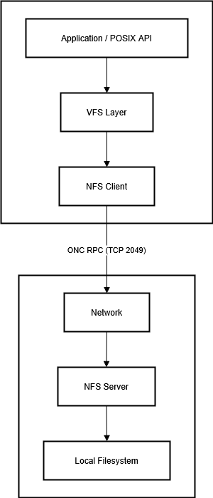

# Network File System (NFS)

> **Kurzüberblick**  
> NFS ist ein offener, plattform­übergreifender Standard zum transparenten Netzwerk-Dateizugriff.  
> Seit der Erstvorstellung durch Sun Microsystems (1984) hat sich NFS – aktuell _v4.2/4.3-Entwurf_ – zum De-facto-Standard im UNIX-/Linux-Umfeld sowie in Cloud- und Virtualisierungs­plattformen entwickelt.

---

## 1  Was ist NFS?

Der **Network File System**-Standard definiert ein *Remote-Procedure-Call*-basiertes Protokoll, mit dem entfernte Dateisysteme so eingebunden werden, als lägen sie lokal vor.  
Grundidee:

1. **Client** fordert Datei-Operation (READ/WRITE/LOOKUP) an.  
2. **NFS-Server** verarbeitet den RPC-Aufruf, greift lokal auf das Dateisystem zu und liefert das Ergebnis zurück.  

Der Zugriff erfolgt datei- und verzeichnisorientiert (anders als block­basierende Protokolle wie iSCSI), wodurch mehrere Hosts parallel dieselben Dateien nutzen können.

---

## 2  Einsatzkontext

| Szenario | Warum NFS? |
|----------|------------|
| **Campus-/Unternehmens-Netze** | Zentrales Home-Verzeichnis, Software-Distribution, Konfigurations­sharing |
| **HPC & Cluster** | POSIX-Semantik, pNFS-Erweiterung für parallelen I/O |
| **Virtualisierung & Container** | Shared Datastore (VM-Images, Container-Layer) ohne SAN-Overhead |
| **Public Cloud** | Managed Services (AWS EFS, Azure NetApp Files, Google Filestore) mit POSIX-API |

Alternativen: SMB/CIFS (Windows-Ökosystem), AFS, Lustre, CephFS – je nach Leistungs- und Featurebedarf.

---

## 3  High-Level-Architektur

Das Schaubild zeigt den **vollständigen Datenpfad**, den eine typische
`read()`- oder `write()`-Operation durchläuft:

1. **Application / POSIX API** – jede Benutzer- oder System-App ruft
   Standard-Syscalls wie `open()`, `read()`, `write()`, `close()` auf.

2. **VFS Layer** – vereinheitlicht verschiedene Dateisystem-Treiber
   (ext4, XFS, NFS, …) und entscheidet, welche Implementierung die
   Anfrage bedienen soll.

3. **NFS Client** – Kernel-Modul, das POSIX-Aufrufe in **ONC RPC**
   übersetzt und über das Netzwerk verschickt.

4. **Network (ONC RPC / TCP 2049)** – hier verlässt der Datenstrom den
   Client-Rechner; alle NFS-Version-4-Pakete laufen über Port 2049
   (optional per TLS oder RDMA).

5. **NFS Server** – erhält RPC-Aufrufe, löst sie in lokale
   Dateisystem-Operationen auf und verwaltet Session-/Lock-Zustände.

6. **Local Filesystem** – physisches oder virtuelles
   Block-Device (ext4, ZFS, XFS usw.), auf dem die eigentlichen Daten
   gespeichert werden.

Der vertikale Aufbau macht deutlich, dass **alles oberhalb des
„Network“-Knotens lokal im Kernel des Clients läuft**, während darunter
Server- und Storage-Ressourcen angesiedelt sind.  
Dadurch wird klar, **wo die Netzwerk­grenze verläuft** und an welcher
Stelle Performance- und Sicherheits­mechanismen (pNFS, Kerberos, TLS,
RDMA) angreifen.



## 4  Technische Funktionsweise

### 4.1  Versionsevolution

| Version | Jahr | Hauptfeatures |
|---------|------|---------------|
| **v2 (RFC 1094)** | 1989 | 32-bit Dateigröße, UDP-basiert, *stateless* |
| **v3 (RFC 1813)** | 1995 | 64-bit Files, asynchrone Writes, READDIRPLUS, *stateless* |
| **v4.0 (RFC 7530)** | 2000 / 2015 | TCP-Pflicht, ACLs, Compound RPCs, **stateful** Sessions |
| **v4.1 (RFC 8881)** | 2010 / 2020 | **Sessions**, Parallel NFS (pNFS) |
| **v4.2 (RFC 7862)** | 2016 | CLONE / COPY OFFLOAD, IO_ADVISE, Sparse-File-Support |
| **v4.3 (I-D)** | = 2024 | Konsolidierung, verpflichtende Features, verbesserte Delegationen |

---

### 4.2  Stateful vs. Stateless

* **v2/v3** – *stateless*: Der Server behält keinen Sitzungszustand. Locks werden über einen separaten Network Lock Manager (NLM) gehandhabt.  
* **v4.x** – *stateful*: Ein einziger TCP-Strom (Port 2049) kapselt Sitzung, Locks, Delegations ? einfachere Firewall-Regeln, bessere WAN-Performance.

---

### 4.3  Sicherheitsmechanismen

| Mechanismus | Kurzbeschreibung |
|-------------|-----------------|
| **AUTH_SYS** | UID/GID im Klartext; geeignet nur in vertrauten Netzen |
| **RPCSEC_GSS / Kerberos 5** | Sichere Authentifizierung, Integritäts- und Datenschutz |
| **NFS over TLS (RFC 9289)** | Volle Transportverschlüsselung direkt auf Port 2049 (ab Linux = 6.7 / FreeBSD 14) |

---

### 4.4  Performance-Features

* **Client-Side Caching** – Attribute- und Datencache mit Timeout-Heuristik  
* **Delegations** – Client bekommt temporäre Exklusivrechte; weniger Round-Trips  
* **pNFS** – Trennt Metadaten-/Datenpfad; Layout-Typen *files, objects, block/SCSI, NVMe*  
* **RDMA-Transport** – Kernel-Bypass für µs-Latenz und > 100 Gb/s Durchsatz  

---

## 5  Gängige Protokolle, Werkzeuge & Produkte

| Kategorie | Beispiele |
|-----------|-----------|
| **Kernel-Server** | `nfsd`, `rpc.mountd`, `rpc.idmapd` |
| **User-Space-Server** | **nfs-ganesha**, **libnfs** |
| **Client-Tools** | `mount -t nfs`, `/etc/fstab`, `nfsstat`, `showmount` |
| **Monitoring** | `exportfs`, `nfsdcltrack`, Prometheus-Exporter (node-exporter textfile) |
| **Appliances / Cloud** | NetApp ONTAP, Dell PowerScale/Isilon, TrueNAS, AWS EFS, Azure NetApp Files, Google Filestore |
| **Tuning-Optionen** | `rsize/wsize`, `noac`, `actimeo`, `sec=krb5p`, `vers=4.2` |

---

## 6  Typischer Arbeitsablauf (Linux)

```bash
# 1 – Pakete installieren
sudo apt install nfs-kernel-server nfs-common

# 2 – Export definieren
echo "/srv/data 192.168.0.0/24(rw,sync,sec=krb5p,fsid=0)" | sudo tee -a /etc/exports
sudo exportfs -rav          # Reload Exports

# 3 – Client-Mount
sudo apt install nfs-common krb5-user
sudo mount -t nfs4 -o vers=4.2,sec=krb5p server.example:/ /mnt/nfs

# 4 – Statistiken prüfen
nfsstat -m
```

## 7  Best Practices

1. **Zentrale UID/GID-Verwaltung** (LDAP, Active Directory) – verhindert Berechtigungs-Mismatch.  
2. **Sichere Transportschicht**: Firewall nur Port 2049 öffnen; Kerberos + TLS für Vertraulichkeit.  
3. **`rsize` / `wsize` anpassen** – typ. 1 MiB bei 10 GbE; bei RDMA ggf. größer.  
4. **pNFS aktivieren**, wenn mehrere Datenpfade vorhanden (HPC, Scale-Out-NAS).  
5. **Monitoring einbinden** – IOPS, Latenz, Session-Reclaims und „silly rename“ rechtzeitig erkennen.

## Referenzen / Weiterführende Dokumente

1. **RFC 1094** – Network File System Protocol Version 2  
2. **RFC 1813** – NFS Version 3 Protocol Specification  
3. **RFC 7530** – NFS Version 4 Protocol  
4. **RFC 8881** – NFS Version 4.1 Protocol (konsolidierte Fassung 2020)  
5. **RFC 7862** – NFS Version 4.2 Minor Version  
6. **RFC 9289** – NFS over TLS  
7. **RFC 9561** – Parallel NFS (pNFS) SCSI Layout für NVMe Transport  
8. **I-D: draft-ietf-nfsv4-nfs-v4-3** – NFS Version 4.3 (Work in Progress)  
9. Red Hat Docs – *Configuring and Managing NFS*  
10. *The Design and Implementation of the FreeBSD Operating System*, Kapitel 14 (NFS)

