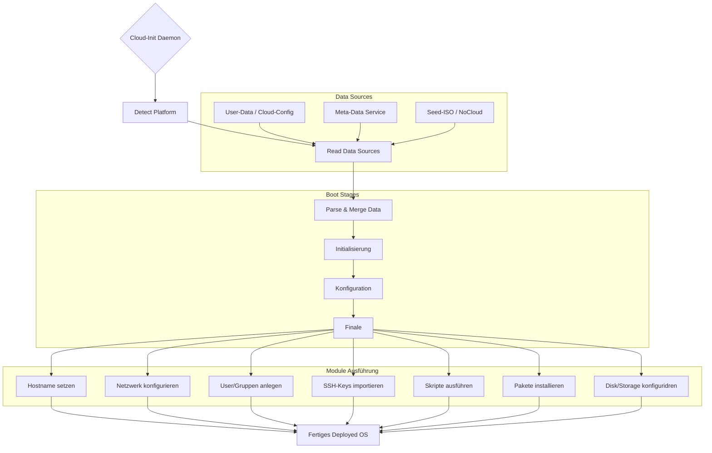

# Cloud-Init
Cloud-Init ist **DAS** Tool um Linux Betriebssysteme vor Deployement schon mit vorausgewählten Konfigurationen zu versehen, ausserdem ist es Open Source und wird von Canonical entwickelt. Exzellent für das automatische Vorbereiten von virtuellen Maschinen, um es ohne Interaktion im Vorhinein managebar zu machen.

**Beispiele für Anwendungen**:
- Hostname setzen
- Netzwerk Interfaces konfigurieren
- User/Gruppen erstellen
- SSH-Keys importieren
- Skripte ausführen

So kann man mit ein paar Zeilen Yaml-Code ein Mal die eigene Lieblings-Config zusammenstellen und für beliebig viele fresh Installs wiederverwenden.

# Einsatzgebiet
Optimal für das oft wiederholte Deployment von generischen Cloud-Images. So lange Linux oder BSD draufsteht, ist Cloud-Init kompatibel.
Weil es aber auch ein bisschen Intelligenz eingebaut hat und zum Beispiel verschiedene Boot-Phasen erkennen kann, ist es sehr robust und adaptiv.

Zum Beispiel muss der Rechner erstmal Internet haben, um eine Ressource installieren zu können. Das und noch viel mehr kann Cloud-Init eigenständig chronologisch gestalten.

# Funktionsweise

### 1. Bereitstellen
Die configs müssen dem OS vor dem ersten Bootvorgang bereitgestellt werden, das kann sein:
- per Commandline durch den Install-Client
- von einem Seed-Image als ISO angehängt, wie von einer CD
- Instance Metadata Service, ein simpler webserver von dem die cloud-config über das Netzwerk geladen werden

### 2. Module durcharbeiten
Nach dem Einlesen der config-Kochrezepte geht es die Anweisungen durch und arbeitet die Module durch.

### 3. Module in richtiger Reihenfolge ausführen


### Rundown Overview



# user-data Beispiel

```yaml=
#cloud-config
users:
  - name: getzi
    groups: sudo
    shell: /bin/bash
    sudo: ["ALL=(ALL) NOPASSWD:ALL"]
    ssh_authorized_keys:
      - ssh-rsa AAAAB3... getzi@host
ssh_pwauth: false
disable_root: true
packages:
  - vim
  - bash-completion
  
runcmd:
  - echo "OS mit cloud-init konfiguriert!" > /home/getzi/welcome.txt
```

# Sources
- [cloud-init docs](https://cloudinit.readthedocs.io/)