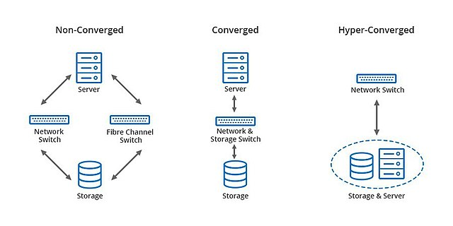

# HCI – Hyperconverged Infrastructure (ausführlich & einfach erklärt)

## 1. Was ist HCI?

**HCI (Hyperconverged Infrastructure)** ist ein modernes Architekturmodell für Rechenzentren, bei dem die drei zentralen Komponenten eines IT-Systems – **Rechenleistung (Compute), Speicher (Storage)** und **Netzwerk (Networking)** – in einer **einheitlichen, softwaregesteuerten Plattform** zusammengefasst werden.

Anstatt separate Server, Speicherlösungen (wie SAN/NAS) und Netzwerkgeräte zu betreiben, werden bei HCI alle diese Funktionen auf **Standard-Hardware (meist x86-Servern)** gebündelt und zentral über Software verwaltet.

---

## 2. Warum ist HCI wichtig?

Traditionelle IT-Infrastruktur ist oft **komplex**, schwer zu skalieren und mit hohem **Verwaltungsaufwand** verbunden – unterschiedliche Systeme, Hersteller, Schnittstellen.

**HCI löst diese Probleme**, indem sie:
- Hardware-Ressourcen vereinheitlicht
- Verwaltung stark vereinfacht
- Skalierung durch das Hinzufügen weiterer Knoten erleichtert
- Ausfallsicherheit integriert
- Virtualisierung eng mit Infrastruktur verknüpft

---

## 3. In welchen Bereichen wird HCI eingesetzt?

- **Private Cloud** – als Basis für virtualisierte Umgebungen
- **Edge Computing** – für kleinere Standorte mit wenig IT-Personal
- **Backups & Notfallwiederherstellung** – integrierte Lösungen mit hoher Verfügbarkeit
- **Kleinere und mittlere Unternehmen (KMU)** – geringer Platz- und Verwaltungsaufwand
- **Rechenzentren großer Unternehmen** – als flexible, modulare Lösung

---

## 4. Technische Funktionsweise (grob erklärt)

Eine HCI-Umgebung besteht aus mehreren sogenannten **Nodes (Knoten)**. Jeder Node enthält:

- **CPU & RAM** (für Rechenleistung)
- **Speicher** (oft SSD + HDD kombiniert)
- **Netzwerkanschlüsse**

Diese Nodes werden über ein internes Netzwerk zu einem **Cluster** verbunden. Die **Software-Ebene (Hypervisor + Management)** sorgt dafür, dass alle Ressourcen gemeinsam genutzt werden können. Speicher und Rechenleistung werden sozusagen „virtualisiert“ und logisch zugewiesen – unabhängig davon, auf welchem physischen Server sie gerade liegen.

**Zentrale Merkmale:**
- **Storage-Virtualisierung**: Jeder Node bringt Speicher mit ein → gemeinsam nutzbarer Pool
- **Skalierbarkeit**: Neue Nodes einfach hinzufügen
- **Failover & Redundanz**: Fällt ein Node aus, übernehmen andere automatisch
- **Zentrale Verwaltung** über eine Management-Oberfläche

---

## 5. Gängige Software, Anbieter und Tools

### Anbieter & Plattformen

- **VMware vSAN** – Integration in VMware vSphere, weit verbreitet
- **Nutanix** – Pionier im HCI-Bereich, mit eigener Plattform (AHV, Prism)
- **Microsoft Azure Stack HCI** – HCI für Windows-Umgebungen
- **Dell EMC VxRail** – vorkonfigurierte VMware-basierte Lösung
- **HPE SimpliVity** – mit Backup und Deduplizierung
- **Scale Computing** – kompakte HCI-Lösungen für Edge Computing

---

## 6. Architektur

---

## Zusammenfassung

- **HCI = Rechenleistung + Speicher + Netzwerk** in einem System
- Alles wird zentral über Software verwaltet
- Spart Platz, Kosten und vereinfacht Verwaltung
- Ideal für Virtualisierung, Edge Computing, Private Cloud
- Skalierbar durch Hinzufügen von Nodes
- Wichtige Anbieter: **VMware, Nutanix, Microsoft, Dell, HPE**

