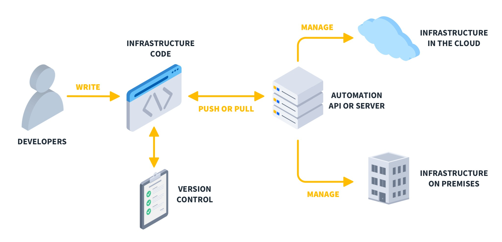

# Infrastructure as Code (IaC)

Infrastructure as Code (IaC) bezeichnet einen modernen Ansatz zur Verwaltung und Bereitstellung von IT-Infrastruktur über maschinenlesbare Konfigurationsdateien anstatt manueller Prozesse. Dabei wird Infrastruktur – wie Server, Netzwerke oder Load Balancer – nicht mehr über grafische Benutzeroberflächen oder per Hand eingerichtet, sondern über deklarativen oder imperativen Code beschrieben und automatisiert bereitgestellt.

Die Idee dahinter ist vergleichbar mit klassischer Softwareentwicklung: Infrastruktur wird versioniert, getestet und wiederholbar ausgeliefert, also ähnlich wie Programmcode. Dadurch wird eine konsistente, nachvollziehbare und skalierbare Infrastrukturverwaltung möglich.

## Kontext und Einsatzgebiete

Infrastructure as Code kommt vor allem in DevOps-Umgebungen, bei Cloud-Migrationen und in Continuous Deployment Pipelines zum Einsatz. Insbesondere bei dynamischen, skalierbaren Systemen (z. B. Microservices, Cloud-native Anwendungen) ist es essenziell, dass Infrastruktur wiederholbar, fehlerfrei und automatisiert bereitgestellt werden kann.

Typische Anwendungsbeispiele sind:
- das automatisierte Erstellen von Cloud-Ressourcen (z. B. bei AWS, Azure oder GCP),
- das Einrichten ganzer Test- oder Produktionsumgebungen mit nur einem Befehl,
- die Definition von Netzwerkkonfigurationen, Security-Gruppen, Datenbanken etc.

## Technische Funktionsweise

Grundlage von IaC ist die Beschreibung der gewünschten Infrastruktur in Codeform. Dabei unterscheidet man zwei Hauptansätze:

1. **Deklarativ**: Es wird beschrieben, *was* das gewünschte Ziel ist (z. B. „ein Server mit Ubuntu 22.04“). Das Tool kümmert sich selbst darum, wie dieses Ziel erreicht wird.
2. **Imperativ**: Es wird schrittweise beschrieben, *wie* der Zielzustand erreicht wird (z. B. „erstelle VM → installiere Paket → konfiguriere Firewall“).

IaC-Dateien werden meist in YAML, JSON, HCL oder ähnlichen Formaten geschrieben und in Versionskontrollsystemen wie Git gespeichert. Sie können automatisiert ausgeführt und überprüft werden – man spricht dann oft auch von „GitOps“.

## Gängige Tools und Beispiele

| Tool           | Typ           | Beschreibung |
|----------------|----------------|--------------|
| **Terraform**  | deklarativ     | Cloud-agnostisches Tool zur Verwaltung von Infrastruktur über HCL |
| **AWS CloudFormation** | deklarativ | Infrastrukturdefinition speziell für AWS-Services |
| **Ansible**    | imperativ     | Konfigurationsmanagement mit YAML und Playbooks |
| **Pulumi**     | deklarativ / imperativ | Kombination aus IaC und realen Programmiersprachen wie Python, Go |
| **Chef / Puppet** | imperativ    | Frühe Vertreter für automatisiertes Konfigurationsmanagement |

IaC wird meist im Rahmen von **CI/CD-Prozessen** verwendet, oft in Kombination mit Git, Containerisierung (z. B. Docker) und Orchestrierung (z. B. Kubernetes). Durch die klare Trennung von Konfiguration und Ausführung ist auch eine sogenannte „drift detection“ möglich – Abweichungen vom definierten Sollzustand werden erkannt und können automatisch korrigiert werden.

## Visualisierung

*Quelle: https://www.cbtnuggets.com/blog/technology/programming/infrastructure-as-code-iac*

Die Grafik zeigt den typischen Ablauf bei Infrastructure as Code: Entwickler schreiben Konfigurationsdateien, die in einem Versionskontrollsystem wie Git verwaltet werden. Diese Dateien werden von einem Automatisierungsserver oder API verarbeitet, der anschließend die Infrastruktur bereitstellt – entweder in der Cloud oder lokal im Rechenzentrum. Das Zusammenspiel von Versionierung, Code und automatisierter Ausführung bildet das zentrale Prinzip von IaC.

## Vorteile und Nachteile

Ein zentraler Vorteil von Infrastructure as Code liegt in der Möglichkeit, Infrastruktur reproduzierbar, versionierbar und automatisiert bereitzustellen. Durch den Einsatz von Code anstelle manueller Konfigurationen lassen sich ganze Umgebungen mit wenigen Befehlen erstellen, duplizieren oder zurücksetzen. Änderungen sind nachvollziehbar dokumentiert, was insbesondere in Teams die Zusammenarbeit und Qualitätssicherung erleichtert. Damit eignet sich IaC ideal für dynamische Systeme, bei denen Skalierbarkeit und Konsistenz entscheidend sind.

Demgegenüber stehen gewisse Einschränkungen. Die initiale Einrichtung von Tools und Strukturen erfordert Einarbeitung und saubere Planung. Zudem besteht die Gefahr, dass Fehlkonfigurationen im Code sich automatisiert auf viele Systeme gleichzeitig auswirken. Auch das Testen von Infrastrukturcode stellt eigene Herausforderungen dar. Insgesamt überwiegen jedoch die Vorteile, insbesondere bei der Verwaltung komplexer, dynamischer Systeme.

## Abgrenzung zur klassischen Infrastrukturverwaltung

Im Vergleich zur klassischen, manuellen Infrastrukturverwaltung über grafische Oberflächen oder Ad-hoc-Skripte ermöglicht IaC eine deutlich systematischere Arbeitsweise. Während bei traditionellen Ansätzen Fehlerquellen durch menschliche Bedienung häufig sind, reduziert IaC diese durch standardisierte Konfigurationsdateien. Gleichzeitig bringt der Ansatz neue Herausforderungen mit sich: Die initiale Einrichtung ist komplexer, und Fehlkonfigurationen im Code können sich automatisiert auf viele Systeme gleichzeitig auswirken. Dennoch bietet IaC langfristig mehr Kontrolle, Sicherheit und Skalierbarkeit – insbesondere in dynamischen Cloud-Umgebungen.

## Fazit

Infrastructure as Code steht für den Wandel von manueller Infrastrukturverwaltung hin zu automatisierter, reproduzierbarer und versionskontrollierter Konfiguration. Durch den Einsatz von Tools wie Terraform oder Ansible kann Infrastruktur wie regulärer Code behandelt werden, mitsamt Review, Tests und Rollbacks.

Das macht IaC zu einem zentralen Bestandteil moderner DevOps-Strategien und einer Voraussetzung für effiziente, skalierbare IT-Systeme in der Cloud.

## Übersichtsquellen
*https://learn.microsoft.com/en-us/devops/deliver/what-is-infrastructure-as-code*

*https://www.cbtnuggets.com/blog/technology/programming/infrastructure-as-code-iac*

*https://en.wikipedia.org/wiki/Infrastructure_as_code*

## Weiterführende Quellen
*https://books.google.at/books?hl=de&lr=&id=UW4NEAAAQBAJ&oi=fnd&pg=PP1&dq=infrastructure+as+code&ots=cdmSVM3MUv&sig=NTdTUgwXiyUSFKttFn6SrnjMcbc&redir_esc=y#v=onepage&q=infrastructure%20as%20code&f=false*

*https://books.google.at/books?hl=de&lr=&id=dFaKEAAAQBAJ&oi=fnd&pg=PT22&dq=infrastructure+as+code&ots=keXEsGWFAo&sig=no1mhjuwS-Gp_ZpcNR3xPdxLDl8&redir_esc=y#v=onepage&q=infrastructure%20as%20code&f=false*

*https://dergipark.org.tr/en/download/article-file/3463145*
