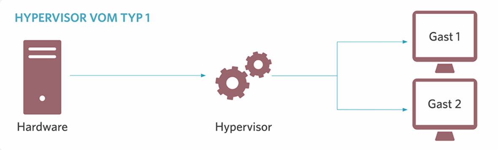
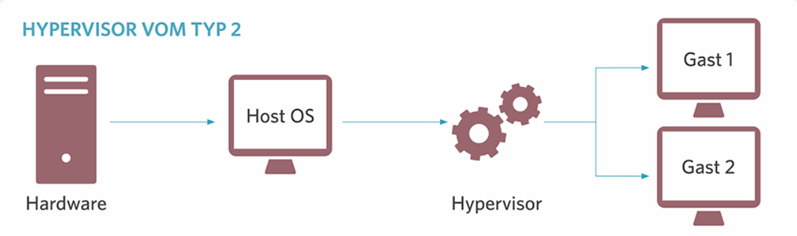

# History of Virtualization Technology

## 1. Was ist Virtualisierung?

Virtualisierung ist eine Technologie, die es ermöglicht, mehrere virtuelle Instanzen (auch als virtuelle Maschinen, VMs bezeichnet) auf einer einzigen physischen Hardware zu betreiben. Diese virtuellen Maschinen agieren unabhängig voneinander und verhalten sich so, als wären sie eigenständige Computer mit eigenem Betriebssystem und eigenen Anwendungen. Die Virtualisierungstechnologie schafft eine abstrakte Schicht, die es den virtuellen Maschinen ermöglicht, die Ressourcen der physischen Hardware effizient zu teilen.

### Grundlegende Typen der Virtualisierung
- **Server-Virtualisierung:** Auf einem physischen Server laufen mehrere virtuelle Server.
- **Desktop-Virtualisierung:** Erlaubt die Ausführung von virtuellen Desktop-Umgebungen auf einem zentralen Server.
- **Storage-Virtualisierung:** Bündelt Speicherressourcen von verschiedenen physischen Geräten zu einer logischen Einheit.
- **Anwendungsvirtualisierung:** Trennung der Anwendung von der zugrundeliegenden Infrastruktur, sodass Anwendungen in verschiedenen Umgebungen ausgeführt werden können.

## 2. Kontext der Verwendung

Virtualisierung ist eine Schlüsseltechnologie in der modernen IT-Infrastruktur. Sie wird in einer Vielzahl von Szenarien eingesetzt, darunter:

- **Cloud-Computing:** Virtualisierung ermöglicht es, Cloud-Dienste auf flexiblen und skalierbaren Infrastrukturen bereitzustellen.
- **Serverkonsolidierung:** Reduziert die Anzahl der physischen Server, indem mehrere virtuelle Maschinen auf einer einzigen Hardware laufen.
- **Entwicklung und Test:** Entwickler können virtuelle Maschinen schnell erstellen und löschen, um verschiedene Softwareumgebungen zu testen.
- **Desktops und Anwendungen:** Benutzer können auf virtuelle Desktops zugreifen, die von einem zentralen Server bereitgestellt werden.

## 3. Technische Funktionsweise

Die Funktionsweise der Virtualisierung basiert auf einer Software-Schicht, die als **Hypervisor** bezeichnet wird. Der Hypervisor ermöglicht es, mehrere virtuelle Maschinen auf einer physischen Maschine auszuführen. Es gibt zwei Hauptarten von Hypervisoren:

- **Typ 1 (bare-metal) Hypervisor:** Diese Hypervisoren laufen direkt auf der Hardware des Hosts ohne ein darunter liegendes Betriebssystem. Beispiele: VMware ESXi, Microsoft Hyper-V, KVM, Nutanix AHV, Citrix Hypervisor.

- **Typ 2 (hosted) Hypervisor:** Diese Hypervisoren laufen auf einem bestehenden Betriebssystem und virtualisieren dann die Hardware. Beispiele: Oracle VirtualBox, VMware Workstation, Parallels Desktop, QEMU.

Die virtuelle Maschine erhält ihre Ressourcen (CPU, RAM, Festplattenspeicher) vom Hypervisor, der diese Ressourcen zwischen den virtuellen Maschinen aufteilt. Der Hypervisor verwaltet auch die I/O-Operationen und den Netzwerkverkehr der VMs.

## 4. Geschichte der Virtualisierung

### Die Anfänge (1960er Jahre)
Die Virtualisierung hat ihre Wurzeln in den 1960er Jahren, als IBM mit der Entwicklung der **CP-67 (Control Program-67)** begann. Diese Technologie ermöglichte es, mehrere Benutzer gleichzeitig auf einem Mainframe-Computer arbeiten zu lassen, ohne dass sie sich gegenseitig stören konnten. CP-67 war der Vorläufer des modernen Hypervisors.

### 1970er Jahre
IBM führte in den 1970er Jahren die **VM/370**-Plattform ein, die als erste wirklich erfolgreiche Implementierung der Virtualisierung betrachtet wird. Diese Plattform erlaubte es, mehrere virtuelle Maschinen auf einem einzigen Mainframe auszuführen, was den Weg für die Entwicklung der modernen Virtualisierungstechnologien ebnete.

### 1990er Jahre
In den 1990er Jahren trat die Virtualisierung in die Welt der x86-Architektur ein. Unternehmen wie VMware begannen, Software-Lösungen zu entwickeln, die es ermöglichten, mehrere Betriebssysteme auf einem x86-Server auszuführen. VMware revolutionierte die Branche, indem es einen Software-basierten Hypervisor (VMware Workstation) einführte, der es den Benutzern ermöglichte, virtuelle Maschinen auf normalen PCs zu betreiben.

### 2000er Jahre
Die 2000er Jahre brachten die **Server-Virtualisierung** in den Mainstream. Mit Tools wie **VMware ESXi** und **Microsoft Hyper-V** begann die Technologie, in Rechenzentren weit verbreitet zu werden. Die Virtualisierung von Servern half, die Hardware-Auslastung zu verbessern und die IT-Infrastrukturen kostengünstiger zu machen. Zu dieser Zeit begann auch der Aufstieg des **Cloud-Computings**, bei dem Virtualisierung eine Schlüsselrolle spielt.

### 2010er Jahre bis heute
In den letzten Jahren hat sich die Virtualisierung weiterentwickelt, um die **Containerisierung** zu integrieren. Technologien wie **Docker** und **Kubernetes** ermöglichen es, Softwareanwendungen in isolierten Containern auszuführen, was eine leichtere, schnellere und flexiblere Form der Virtualisierung darstellt. Virtualisierung wird nun nicht nur für Server, sondern auch für Netzwerke, Speicher und Desktops verwendet.

## 5. Gängige Protokolle, Produkte und Tools

- **Protokolle:**
  - **VMware vSphere:** Ein Hypervisor und Verwaltungstool von VMware für die Verwaltung von virtuellen Maschinen in Unternehmensnetzwerken.
  - **Microsoft Hyper-V:** Ein von Microsoft entwickelter Hypervisor, der auf Windows Server-Plattformen verwendet wird.
  - **KVM (Kernel-based Virtual Machine):** Ein Open-Source-Hypervisor für Linux-basierte Systeme.

- **Produkte und Tools:**
  - **VMware ESXi:** Eine der bekanntesten Plattformen für die Server-Virtualisierung.
  - **Oracle VirtualBox:** Eine Open-Source-Plattform für Desktop-Virtualisierung.
  - **Docker und Kubernetes:** Für Container-basierte Virtualisierung und Management.
  - **Red Hat Virtualization (RHV):** Eine Virtualisierungslösung, die auf KVM basiert und von Red Hat angeboten wird.

## Fazit

Die Geschichte der Virtualisierung zeigt eine spannende Reise von den ersten Mainframe-basierten Systemen bis hin zu den modernen, flexiblen Virtualisierungs- und Containerlösungen, die in Rechenzentren, Cloud-Umgebungen und Desktops weit verbreitet sind. Die Technologie hat die IT-Infrastrukturen revolutioniert, indem sie eine höhere Ressourcennutzung, Kostensenkung und die Schaffung flexiblerer IT-Umgebungen ermöglicht hat.

