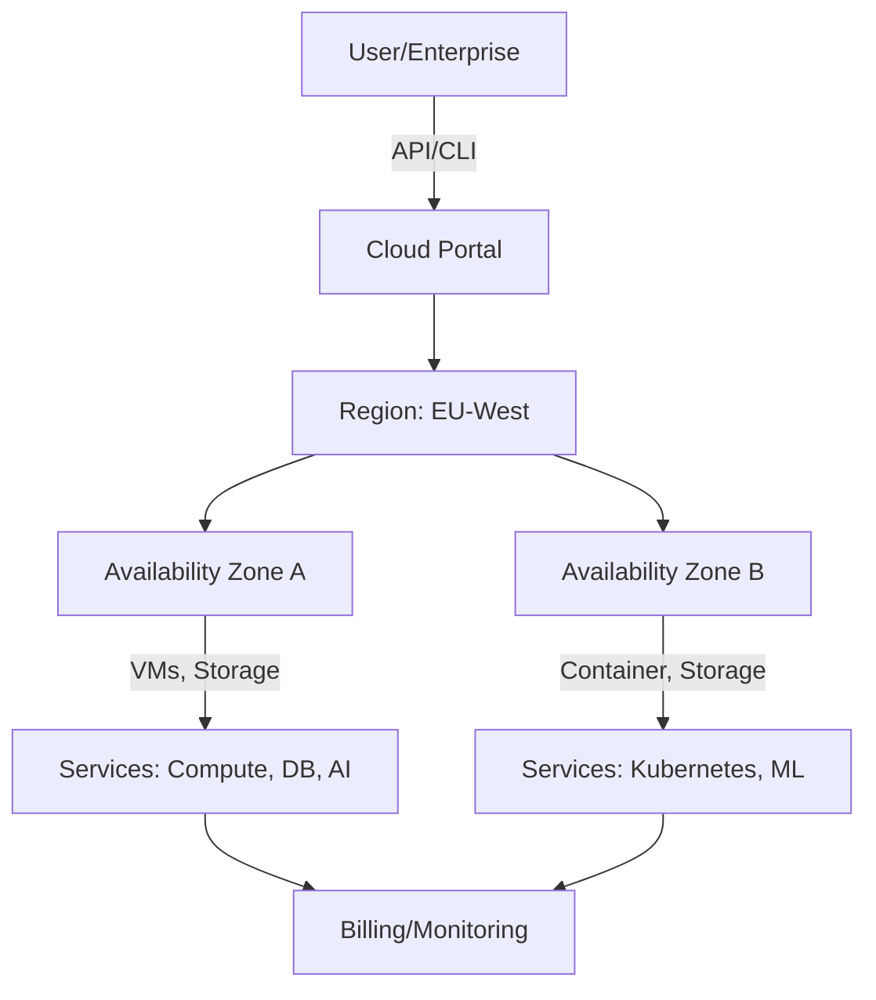

# Hyperscaler/Cloud-Providers: DACH, EU und USA – Überblick & Vergleich

## 1. Worum handelt es sich bei dem Begriff?

**Hyperscaler** sind Unternehmen, die massiv skalierbare Cloud-Infrastrukturen betreiben und anbieten. Sie zeichnen sich durch die Fähigkeit aus, Millionen von Servern weltweit effizient zu verwalten und ihren Kunden Dienste wie Rechenleistung, Speicher, Datenbanken, KI-Services und mehr „on demand“ zur Verfügung zu stellen.

Cloud-Provider lassen sich allgemein in drei Kategorien unterteilen:

- **Public Cloud**: Dienste über das öffentliche Internet  
- **Private Cloud**: Exklusiv für ein Unternehmen bereitgestellte Dienste  
- **Hybrid Cloud**: Kombination aus beidem

**Hyperscaler** sind Public Cloud Provider, die extreme Skalierbarkeit und globale Verfügbarkeit bieten – z. B. Amazon Web Services (AWS), Microsoft Azure oder Google Cloud Platform (GCP).

---

## 2. In welchem Kontext wird der Begriff verwendet?

Hyperscaler sind zentrale Akteure im Bereich:

- **Digitalisierung & Industrie 4.0**
- **Künstliche Intelligenz und Big Data**
- **Globale IT-Infrastruktur**
- **Edge Computing und IoT**
- **Compliance, Datenschutz und Souveränität**

In Europa – besonders in der DACH-Region – wird der Begriff häufig im Kontext von **Cloud-Souveränität** diskutiert, da Hyperscaler aus den USA dominieren, was Datenschutzbedenken (z. B. DSGVO, CLOUD Act) aufwirft.

---

## 3. Vereinfachte technische Funktionsweise 

Hyperscaler betreiben verteilte **Rechenzentren** in sogenannten **Availability Zones** (AZs), organisiert in **Regions**. Ein Kunde kann seine Workloads so redundant, skalierbar und hochverfügbar auf mehrere Zonen verteilen.

### Architekturprinzipien:

- Virtualisierung (VMs, Container)  
- Automatisierung & Orchestrierung  
- Infrastructure as Code (IaC)  
- SDN (Software Defined Networking)  
- Globale Lastverteilung (Load Balancing)  

---

## 4. Gängige Protokolle, Produkte & Tools

### Beispiele führender Hyperscaler:

| Anbieter         | Herkunft     | Marktanteil global | Beispiel-Produkte                     |
|------------------|--------------|---------------------|----------------------------------------|
| AWS              | USA          | ~30 %               | EC2, S3, Lambda, RDS                   |
| Microsoft Azure  | USA          | ~25 %               | Azure VM, Blob Storage, Azure ML       |
| Google Cloud     | USA          | ~10 %               | GCE, GKE, BigQuery                     |
| Alibaba Cloud    | China        | ~4–5 %              | ECS, OSS, AnalyticDB                   |
| OVHcloud         | Frankreich   | <1 %                | Public Cloud, Hosted Private Cloud     |
| IONOS Cloud      | Deutschland  | <1 %                | Compute Engine, S3-kompatibler Storage |

### Wichtige Tools & Protokolle:

- **Kubernetes** (Container-Orchestrierung)  
- **Terraform** (Infrastructure as Code)  
- **RESTful APIs**, **gRPC**  
- **HTTPS**, **SSH**, **SAML/OAuth** (Sicherheit)

### Lokale Cloud-Anbieter in Österreich

**A1 Digital & Exoscale**

A1, betreibt gemeinsam mit seiner Tochtergesellschaft Exoscale eine Public Cloud Zone in Wien.

Besonderheiten:

- Datenhaltung ausschließlich in Österreich

- Einhaltung der DSGVO und der EU-Richtlinie NIS-2

- Eigene Softwareentwicklung und Nutzung neuester Intel-Technologien

- Angebot von Diensten wie „fully managed Kubernetes“ und „Database as a Service“

**eww ITandTEL**

Ein österreichischer Cloud-Provider mit Rechenzentren in Österreich, der auf VMware-Technologien setzt.

Besonderheiten:

- Angebot von GPU-Hosting für KI-Anwendungen in Zusammenarbeit mit dem Linzer Startup FiveSquare

- Teilnahme an der Austrian Cloud-Initiative

---

## 5. Architektur/Schaubild

---

## 6. Vergleich DACH/EU/USA

| Kriterium              | DACH/EU Provider                          | US-Hyperscaler                            |
|------------------------|-------------------------------------------|--------------------------------------------|
| **Datenschutz / DSGVO**| Sehr stark konform                        | Eingeschränkt (z. B. durch CLOUD Act)       |
| **Marktmacht**         | Gering (lokale Anbieter)                  | Sehr hoch (AWS, Azure, GCP)                |
| **Innovationstempo**   | Solide, aber langsamer                    | Sehr hoch (z. B. AI, Machine Learning)      |
| **Cloud-Souveränität** | Hoch (z. B. durch GAIA-X, EUCS)           | Eingeschränkt (US-Kontrolle möglich)       |
| **Kompatibilität**     | Teilweise beschränkt                      | Sehr breit gefächerte Dienste & APIs        |
| **Kostenstruktur**     | Oft transparenter, Fixpreise möglich      | Flexibel, aber komplex (Pay-as-you-go)     |
| **Verfügbarkeit**      | Regional begrenzt (v. a. Europa)          | Global, mit vielen Rechenzentren           |
| **Vertrauen / Akzeptanz** | Hoch im öffentlichen Sektor (z. B. Behörden) | Oft kritisch hinterfragt (Datenschutzbedenken) |

## 7. Quellen

- https://www.redhat.com/de/topics/cloud-computing/what-is-a-hyperscaler
- https://www.purestorage.com/de/knowledge/what-is-a-hyperscaler.html
- https://www.ibm.com/de-de/topics/hyperscale-data-center
